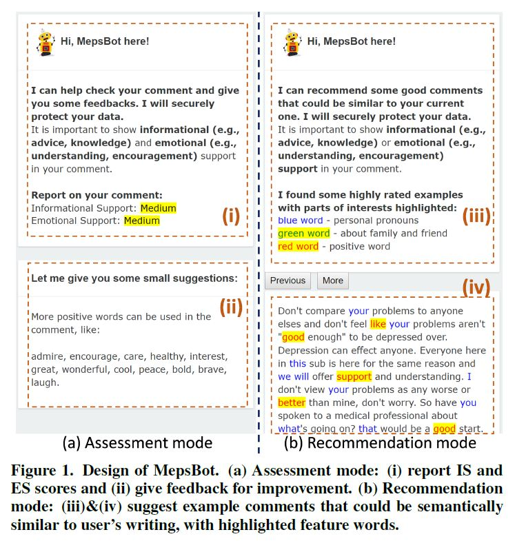
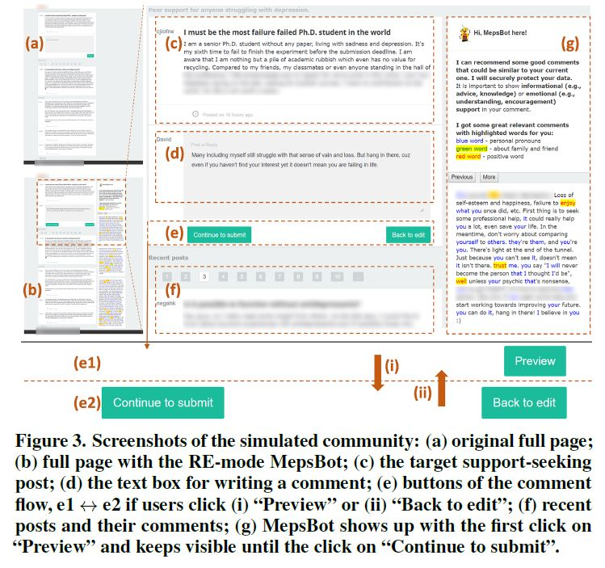

# MepsBot in the simulated online mental health community

Related paper "Exploring the Effects of Technological Writing Assistance
for Support Providers in Online Mental Health Community" gets accepted to CHI 2020: 

## Abstract
Textual comments from peers with informational and emotional
support are beneficial to members of online mental
health communities (OMHCs). However, many comments are
not of high quality in reality. Writing support technologies
that assess **(AS)** the text or recommend **(RE)** writing examples
on the fly could potentially help support providers to improve
the quality of their comments. However, how providers perceive
and work with such technologies are under-investigated.
In this paper, we present a technological prototype MepsBot
which offers providers in-situ writing assistance in either AS
or RE mode. Results of a mixed-design study with 30 participants
show that both types of MepsBots improve users’
confidence in and satisfaction with their comments. The ASmode
MepsBot encourages users to refine expressions and
is deemed easier to use, while the RE-mode one stimulates
more support-related content re-editions. We report concerns
on MepsBot and propose design considerations for writing
support technologies in OMHCs.

### Demo

## Design of MepsBot in two modes

### Assessment-mode MepsBot
Training the classifiers of informational support (IS) and emotional support (ES) using labelled data on Reddit r/depression. We do not provide these data here for the privacy concern. The two models are stored in the folder "models".
For more details, check the file "assessment_backend.py".

### Recommendation-mode MepsBot
We first use IS and ES classifiers to collect a set of high-quality comments in a recommendation pool, and build a dataset using elasticsearch. For privacy concern, we do not provide these comments and the recommendation pool here. Those who want to know how to build it can contact the author via email: zpengab@connect.ust.hk

## Design of the simulated community website

We offer the code to run the simulated community simulated website used in our experiment here. The current logic after clicking "Continue to submit" is that it will directly open next round of commenting procedure (three rounds in the experiment in total). You can change the logic accordingly for your usage. 

## How to run the codes.

### Start the backend server.
####
Assessment-based mode: run **python assessment_backend.py** to start the backend server locally. You may need to install necessary python packages if missed.

####
Recommendation-based mode: 
1) Start the elasticsearch database. You need to install elasticsearch and build database in it. We do not provide the instruction here. You can email us to discuss about it if needed. 
2) Start the Bert server. We encode the comments into vectors to calculate semantic similarity in this mode. Check [bert-as-service](https://github.com/hanxiao/bert-as-service) to invoke this service. Some parameters of the language model and max_seq can refer to the command: C:\Users\Penguin\AppData\Roaming\Python\Python36\Scripts\bert-serving-start.exe -model\_dir uncased\_L-12\_H-768\_A-12\  -num_worker=1 -max_seq\_len=128 
run **python recommendation.py** to start the backend server.

### Start the community website locally
Start the live-server under the **forum_website** directory to run the community website locally. For example, open the Forum directory using Visual Studio Code, and run the command **live-server** in its terminal. You can modify the code to test your own community and writing support tools. 

## Others
You can read the "MepsBot_CHI2020_Zhenhui.pdf" to get more details of our MepsBot.
Hope everyone can be healthy and happy. 

If you use our code and result, please cite our paper, doi: [https://doi.org/10.1145/3313831.3376695 ](https://doi.org/10.1145/3313831.3376695)